# Ingestion 全景关系图

> **语言范围**: 本文档按 **9 种生效语言** 标注：JavaScript / TypeScript / Python / Java / Go / C / C++ / C# / Rust。
> 代码中另有 7 种降级语言（PHP / Ruby / Kotlin / Swift / Dart / Vue / Cobol），其 grammar/provider/resolver 存在但不在 9 语言生效范围内。
> 图中以 ✅ 标注生效、⚠ 标注降级。LadybugDB 32 种 NODE_TABLES schema 不受语言范围影响，仅实际写入行数减少。

## 1. 顶层 Pipeline 编排

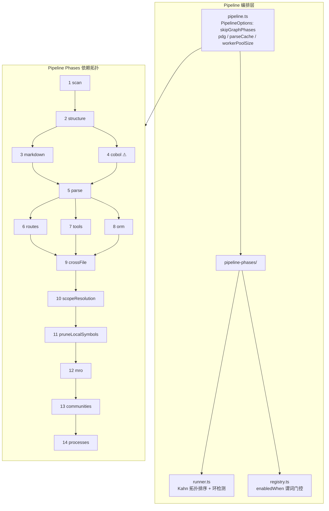

## 2. Worker 并行解析架构

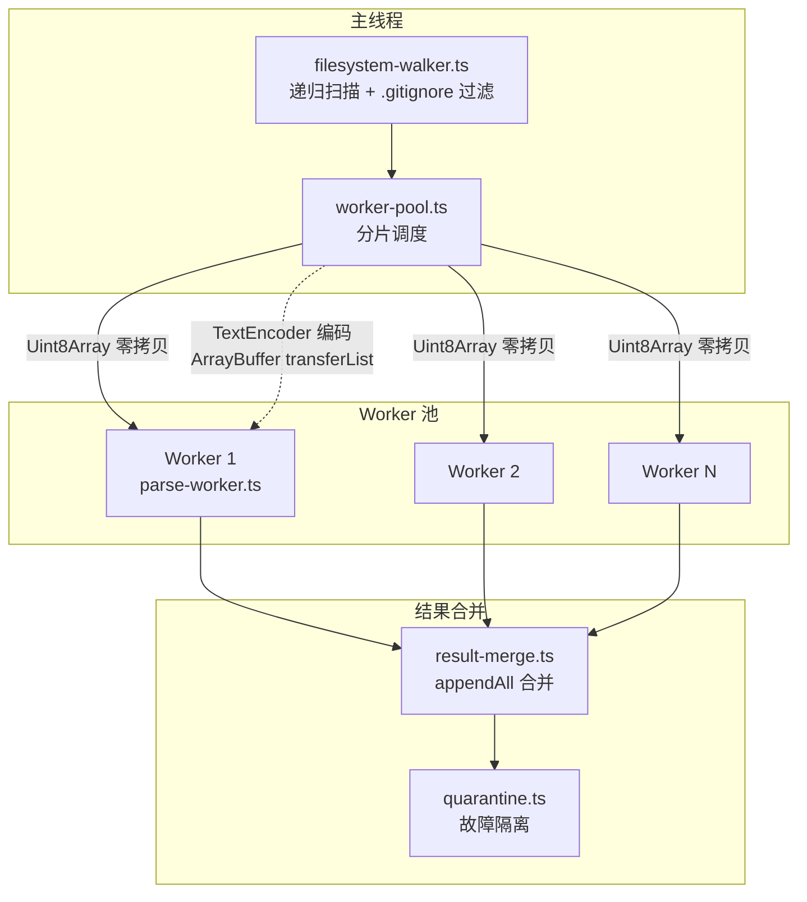

## 3. Parse Worker 内部流程

```mermaid
graph TB
    subgraph Grammars["语法加载 (9 种生效 + 7 种降级)"]
        G1[javascript / typescript / tsx]
        G2[python / java / go]
        G3[c-sharp / cpp / c / rust]
        G4_off["⚠ 降级: php / ruby<br/>grammar 在但代码逻辑不生效"]
        G5_off["⚠ 降级: swift / dart / kotlin<br/>vendored grammars，条件加载"]
        G6_vue["⚠ Vue: 复用 TS grammar<br/>无独立 grammar"]
        G7_cobol["⚠ Cobol: 无 grammar<br/>regex 提取"]
    end

    subgraph Parse["AST 解析"]
        GL[语法选择<br/>getLanguageFromFilename] --> SP[safe-parse<br/>try/catch 包裹]
        SP --> |Tree| TQ[tree-sitter-queries<br/>Capture 匹配]
    end

    subgraph Legacy["传统提取路径 (6 种提取器)"]
        TQ --> CE[call-extractors]
        TQ --> CLE[class-extractors]
        TQ --> FE[field-extractors]
        TQ --> ME[method-extractors]
        TQ --> VE[variable-extractors]
        TQ --> TE[type-extractors]
    end

    subgraph ScopePath["Scope 提取路径"]
        TQ --> SEC[provider.emitScopeCaptures<br/>语言自定义 Capture]
    end

    subgraph Other["其他提取"]
        TQ --> RE[route-extractors<br/>Next.js / Spring / FastAPI<br/>⚠ Laravel(PHP)降级]
        TQ --> VE2[vue-sfc-extractor<br/>⚠ Vue降级，不生效]
        TQ --> CUP[cpp-ue-preprocessor<br/>UE 反射宏预处理]
    end

    subgraph Assemble["结果组装"]
        CE --> RS[ParseWorkerResult]
        CLE --> RS
        FE --> RS
        ME --> RS
        VE --> RS
        TE --> RS
        SEC --> RS
        RE --> RS
        RS --> PCS[postResultCloneSafe<br/>结构化克隆安全序列化]
    end

    Grammars --> Parse
```

## 4. Scope Extractor 五遍流水线

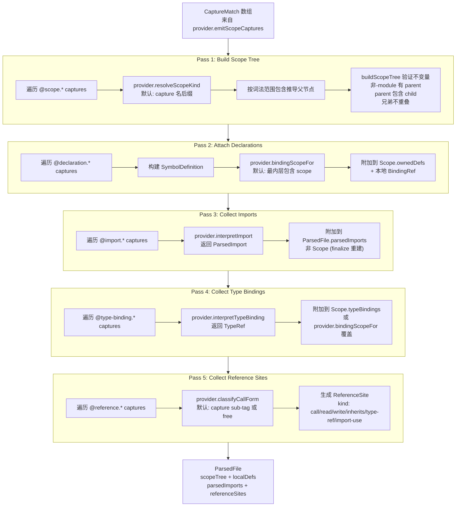

## 5. Finalize Orchestrator

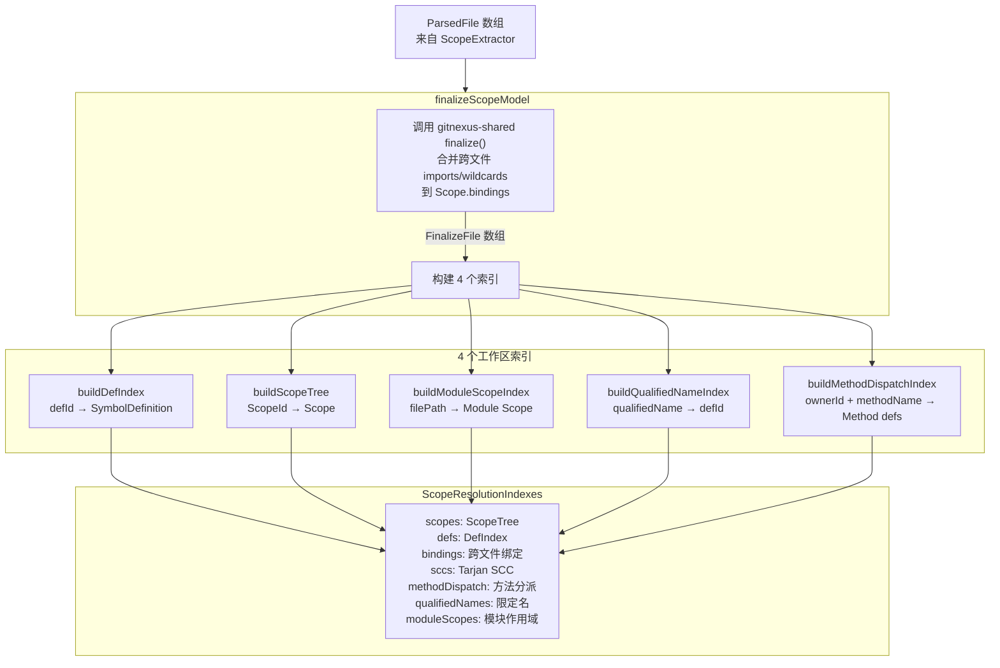

## 6. Scope Resolution 完整流水线

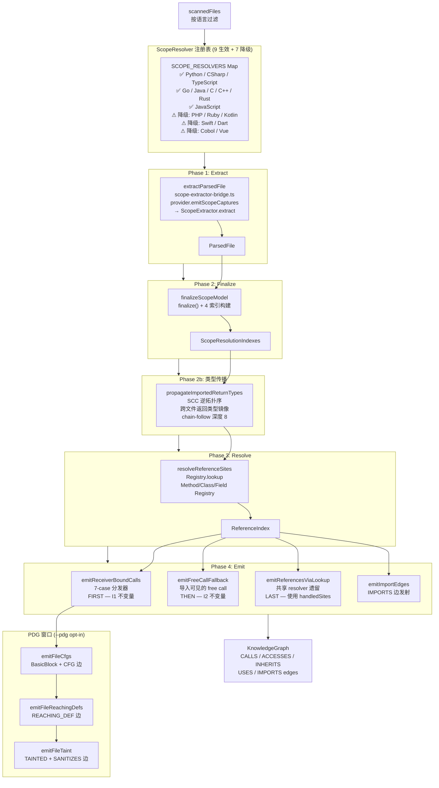

## 7. Receiver-Bound Calls 7-Case 分发器

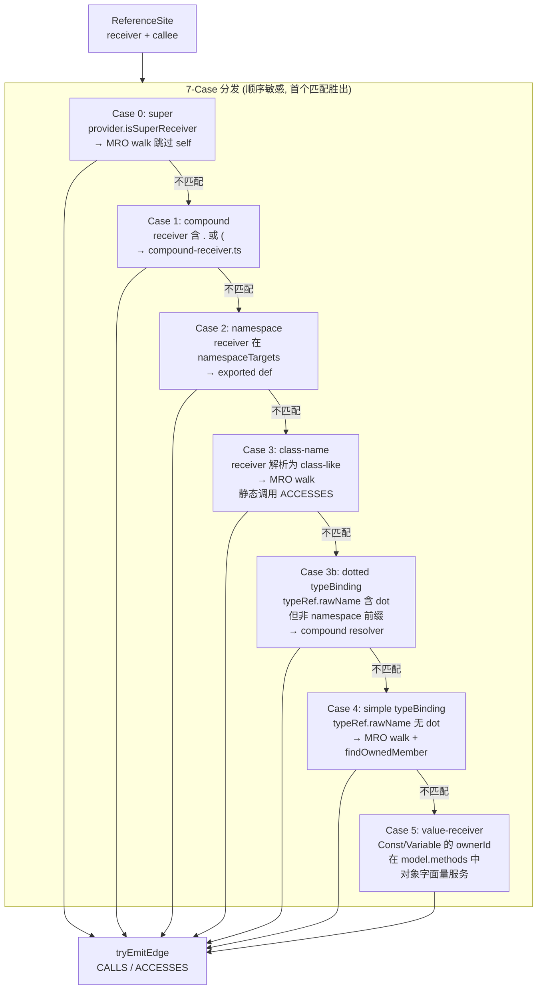

## 8. Overload Narrowing 决策树

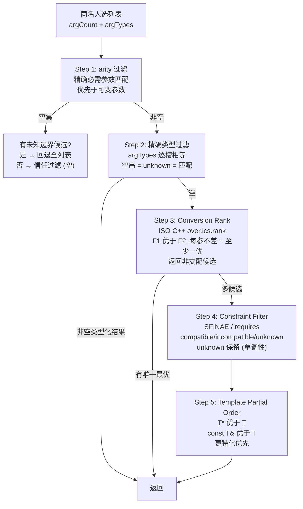

## 9. Compound Receiver 解析

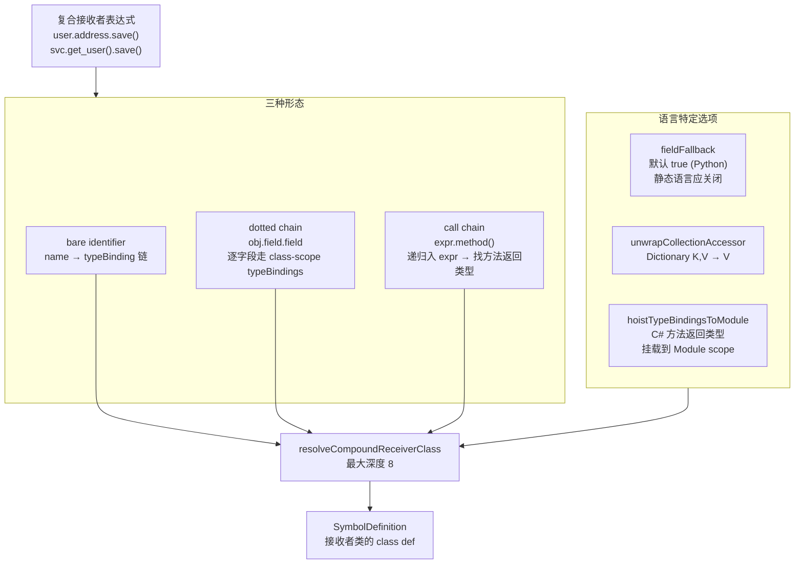

## 10. Semantic Model 分层架构

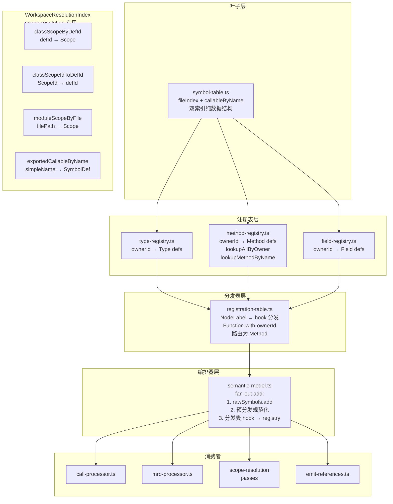

## 11. TypeEnv 三层推断

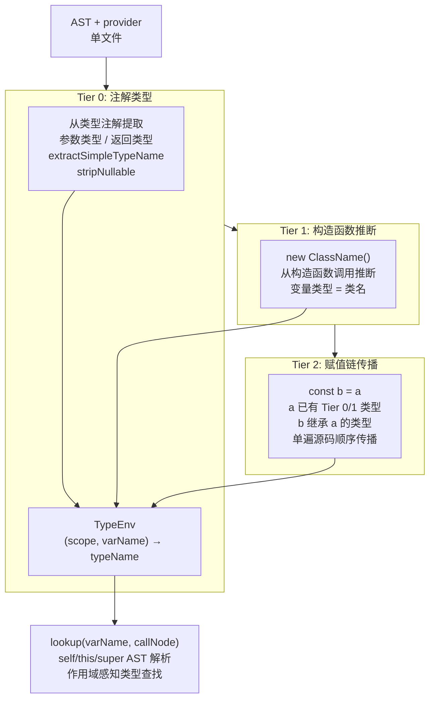

## 12. 提取器 Generic + Config 模式

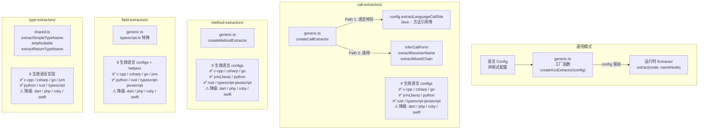

## 13. Import Resolver Factory 策略链

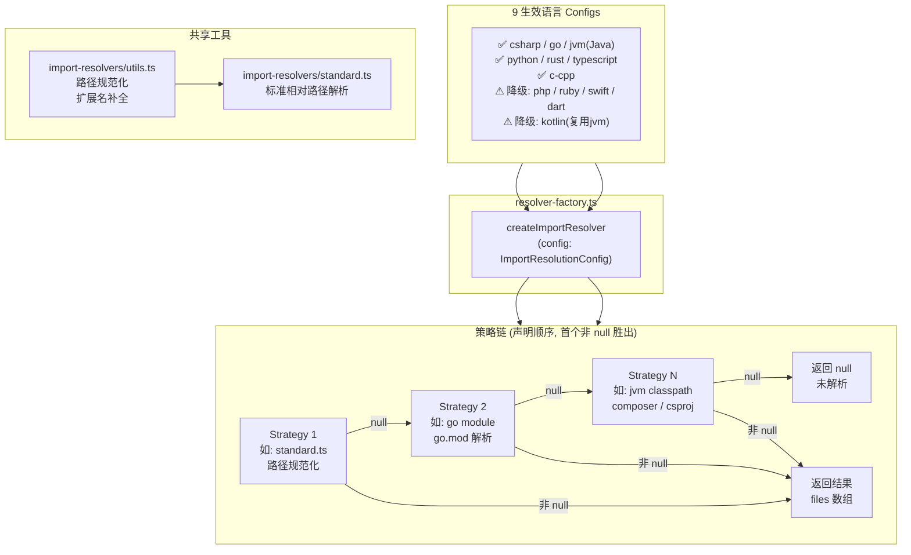

## 14. CFG Builder + Taint 子系统

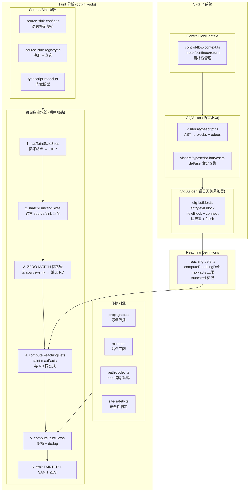

## 15. MRO Processor 流程

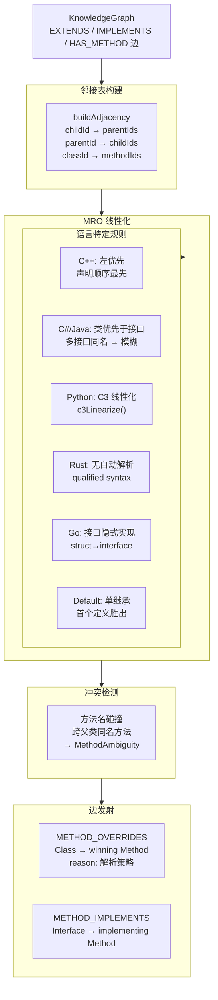

## 16. Community + Process Detection

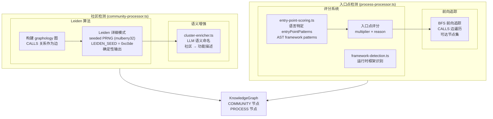

## 17. 语言提供者注册表 + ScopeResolver

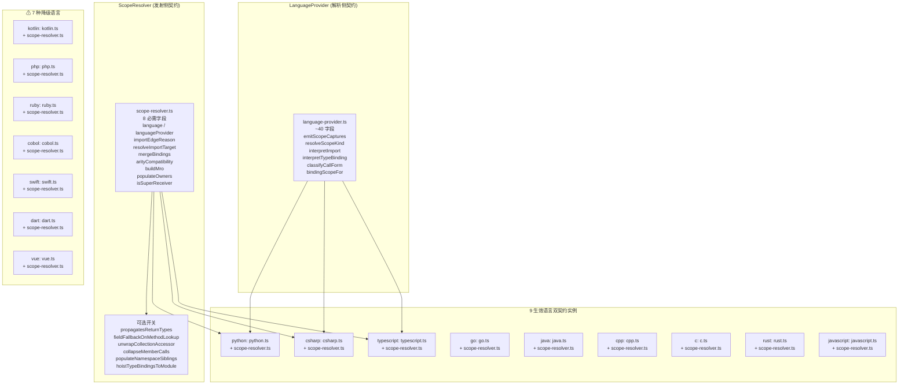

## 18. 核心模块关系总览

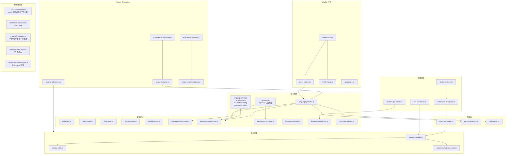

## 19. 数据流总览

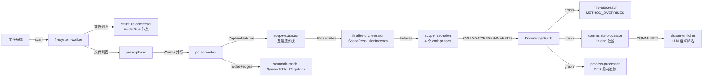

## 20. 存储层架构 — .gitnexus 目录结构

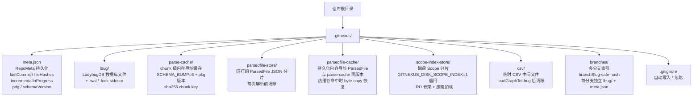

## 21. LadybugDB 数据模型 — 32 种节点表 + 1 关系表

```mermaid
graph TB
    subgraph CoreNodes["核心代码节点 (schema.ts)"]
        F["File<br/>id / name / filePath / content"]
        FD["Folder<br/>id / name / filePath"]
        FN["Function<br/>id / name / filePath / startLine / endLine<br/>isExported / content / description"]
        CL["Class<br/>同 Function 字段"]
        IF["Interface<br/>同 Function 字段"]
        MT["Method<br/>同 Function + parameterCount / returnType"]
        CE["CodeElement<br/>同 Function 字段 (通用回退)"]
    end

    subgraph MultiLang["多语言节点 (19 种，9语言实际生效)"]
        ST["Struct / Enum / Macro / Typedef<br/>id / name / filePath / startLine / endLine<br/>content / description"]
        NS["Namespace / Trait / Impl / TypeAlias<br/>同上"]
        CO["Const / Static / Variable<br/>同上"]
        PR["Property<br/>同上 + declaredType"]
        RC["Record / Delegate / Annotation<br/>Constructor / Template / Module<br/>同上"]
    end

    subgraph SpecialNodes["特殊节点"]
        CM["Community<br/>id / label / heuristicLabel / keywords<br/>description / enrichedBy / cohesion / symbolCount"]
        PC["Process<br/>id / label / heuristicLabel / processType<br/>stepCount / communities / entryPointId / terminalId"]
        SEC["Section<br/>id / name / filePath / startLine / endLine<br/>level / content / description"]
        RT["Route<br/>id / name / filePath<br/>responseKeys / errorKeys / middleware"]
        TL["Tool<br/>id / name / filePath / description"]
        BB["BasicBlock<br/>id / filePath / startLine / endLine / text"]
    end

    subgraph Embedding["向量嵌入"]
        EM["CodeEmbedding<br/>id / nodeId / chunkIndex / startLine / endLine<br/>embedding FLOAT 384d / contentHash"]
        VI["HNSW 向量索引<br/>code_embedding_idx<br/>cosine 相似度"]
        EM --> VI
    end

    subgraph RelTable["CodeRelation (单一关系表)"]
        RT_CORE["核心: CONTAINS / DEFINES / IMPORTS / CALLS<br/>EXTENDS / IMPLEMENTS / HAS_METHOD<br/>HAS_PROPERTY / ACCESSES"]
        RT_MRO["MRO: METHOD_OVERRIDES / OVERRIDES<br/>METHOD_IMPLEMENTS"]
        RT_GRAPH["图级: MEMBER_OF / STEP_IN_PROCESS"]
        RT_API["API: HANDLES_ROUTE / FETCHES<br/>HANDLES_TOOL / ENTRY_POINT_OF"]
        RT_MISC["WRAPS / QUERIES"]
        RT_PDG["PDG: CFG / REACHING_DEF<br/>TAINTED / SANITIZES / TAINT_PATH"]
        RT_ATTR["通用属性: type / confidence<br/>reason / step"]
    end

    CoreNodes --> RelTable
    MultiLang --> RelTable
    SpecialNodes --> RelTable
```

## 22. KnowledgeGraph → LadybugDB 写入流水线 — 汇聚后一次性写入

```mermaid
graph TB
    subgraph Ingestion["14 Phase 汇聚到同一个 KnowledgeGraph"]
        P1["Phase 1-5: scan/structure/md/⚠cobol(parse)/parse<br/>⚠ cobol 9语言下不生效<br/>File/Folder/Section 节点 + 19种符号节点"]
        P6["Phase 6-8: routes/tools/orm<br/>Route/Tool 节点 + 特殊边"]
        P9["Phase 9: crossFile<br/>IMPORTS 边"]
        P10["Phase 10: scopeResolution<br/>CALLS/ACCESSES/INHERITS/EXTENDS<br/>CFG/REACHING_DEF/TAINTED/SANITIZES 边"]
        P11["Phase 11: pruneLocalSymbols<br/>修剪私有符号"]
        P12["Phase 12: mro<br/>METHOD_OVERRIDES/METHOD_IMPLEMENTS 边"]
        P13["Phase 13: communities<br/>Community 节点 + MEMBER_OF 边"]
        P14["Phase 14: processes<br/>Process 节点 + STEP_IN_PROCESS/ENTRY_POINT_OF 边"]
        P1 --> KG["共享 KnowledgeGraph<br/>pipeline.ts 第 242 行<br/>createKnowledgeGraph()"]
        P6 --> KG
        P9 --> KG
        P10 --> KG
        P11 --> KG
        P12 --> KG
        P13 --> KG
        P14 --> KG
    end

    KG --> |"14 Phase 全部完成后<br/>run-analyze.ts 单次调用"| LOAD["loadGraphToLbug<br/>graph → DB 一次性批量写入"]

    subgraph WritePipeline["写入流水线 (顺序执行)"]
        LOAD --> CSV1["Step 1: streamAllCSVsToDisk<br/>单遍遍历 KnowledgeGraph<br/>按 node.label 路由到 32 个 CSV writer<br/>FileContentCache LRU 懒读源码"]
        CSV1 --> CSV2["Step 2: 合并 rel.csv 输出<br/>所有边 → 单一 rel.csv 文件"]
        CSV2 --> SPLIT["Step 3: splitRelCsvByLabelPair<br/>按 FROM→TO 标签对拆分<br/>rel_Function_Function.csv<br/>rel_Function_Method.csv 等"]
        SPLIT --> COPY_N["Step 4: 批量 COPY 节点<br/>逐表顺序执行<br/>LadybugDB 一次只允许一个写事务"]
        COPY_N --> COPY_R["Step 5: 批量 COPY 关系<br/>逐 FROM-TO 对顺序执行<br/>COPY CodeRelation FROM csv<br/>from/to 参数指定标签对"]
        COPY_R --> FTS["Step 6: CREATE_FTS_INDEX<br/>Function.name / Class.name 等"]
        FTS --> EMB["Step 7: 批量 INSERT CodeEmbedding<br/>节点数门控 / 维度守卫<br/>cachedEmbeddings 先恢复"]
        EMB --> VI["Step 8: CREATE_VECTOR_INDEX<br/>HNSW cosine"]
    end

    subgraph IncrementalPath["增量写入路径 (同一 loadGraphToLbug)"]
        HASH["file-hash.ts: SHA-256 diff<br/>→ changed / added / deleted"]
        BFS["importer BFS: MAX_DEPTH=4<br/>queryImporters 读 DB IMPORTS 边<br/>+ shadow-candidates 种子"]
        EFFECTIVE["computeEffectiveWriteSet<br/>1-hop 边界跨越扩展"]
        DEL["deleteNodesForFile: DETACH DELETE<br/>逐表 WHERE filePath<br/>级联删 CodeEmbedding"]
        DEL2["deleteAllCommunitiesAndProcesses<br/>Community/Process 全删重写"]
        SUB["extractChangedSubgraph<br/>只取 writable-set 节点 + 边"]
        HASH --> BFS --> EFFECTIVE --> DEL --> DEL2 --> SUB --> LOAD
    end
```

```mermaid
graph TB
    KG["KnowledgeGraph<br/>ingestion 产出"] --> CSV_GEN["csv-generator.ts<br/>streamAllCSVsToDisk"]

    subgraph CSV_Phase["Phase 1: 流式 CSV 生成"]
        CSV_GEN --> NW["单遍遍历节点<br/>按 label 路由到 32 个 CSV writer"]
        CSV_GEN --> RW["关系 CSV 合并输出<br/>rel.csv 单文件"]
        CSV_GEN --> CC["FileContentCache<br/>LRU 3000 文件<br/>懒读磁盘源码内容"]
        CSV_GEN --> BUF["BufferedCSVWriter<br/>FLUSH_EVERY=500 行<br/>RFC 4180 转义"]
    end

    CSV_Phase --> SPLIT["splitRelCsvByLabelPair<br/>按 FROM-TO 标签对<br/>拆分 rel.csv 为 per-pair CSV"]

    subgraph COPY_Phase["Phase 2: 批量 COPY 导入"]
        SPLIT --> NC["节点 COPY<br/>逐表顺序<br/>COPY Table FROM csv<br/>IGNORE_ERRORS 兜底"]
        SPLIT --> RC["关系 COPY<br/>逐 FROM-TO 对<br/>COPY CodeRelation FROM csv<br/>from/to 标签参数"]
    end

    COPY_Phase --> FTS["Phase 3: FTS 索引<br/>CREATE_FTS_INDEX<br/>File.name / Function.name 等"]
    COPY_Phase --> EMB["Phase 4: Embeddings<br/>skipForCap 节点数门控<br/>snowflake-arctic-embed-xs<br/>批量 INSERT CodeEmbedding"]
    COPY_Phase --> VEC["HNSW 向量索引<br/>CREATE_VECTOR_INDEX<br/>cosine 相似度"]

    subgraph Incremental["增量写入路径"]
        HASH["file-hash.ts<br/>SHA-256 逐文件<br/>diffFileHashes → changed/added/deleted"]
        BFS["importer BFS<br/>MAX_DEPTH=4<br/>queryImporters 读 DB IMPORTS 边"]
        DEL["deleteNodesForFile<br/>DETACH DELETE per table<br/>级联删 CodeEmbedding"]
        SUB["extractChangedSubgraph<br/>只提取 writable-set 节点+边<br/>computeEffectiveWriteSet 1-hop 扩展"]
        HASH --> BFS --> DEL --> SUB
        SUB --> CSV_GEN
    end
```

## 23. 磁盘存储辅助系统

```mermaid
graph TB
    subgraph ParseCache["解析缓存 (parse-cache.ts)"]
        PC_KEY["缓存键: sha256(sorted filePath:contentHash)"]
        PC_VER["版本: SCHEMA_BUMP + pkg.version"]
        PC_HIT["热命中: Worker 不运行<br/>durable store byte-copy 恢复"]
        PC_MISS["冷缺失: Worker 解析<br/>写入 parse-cache + durable"]
    end

    subgraph ParsedFileStore["ParsedFile 磁盘存储"]
        PFS_RUN["运行期: parsedfile-store/<br/>shardId.json per chunk<br/>scope-resolution 消费后清除"]
        PFS_DUR["持久化: parsedfile-cache/<br/>内容寻址 chunk-hash key<br/>与 parse-cache 生命周期同步<br/>pruned by usedKeys"]
        PFS_INT["字符串内联<br/>makeInterningReviver<br/>def-object 内联<br/>Linux kernel 15GB→7.6GB"]
        PFS_RUN --> PFS_INT
        PFS_DUR --> PFS_INT
    end

    subgraph ScopeIndexStore["Scope 磁盘索引 (opt-in)"]
        SIS_ENV["GITNEXUS_DISK_SCOPE_INDEX=1 启用"]
        SIS_SHARD["per-file JSON 分片<br/>s1.json / s2.json / ..."]
        SIS_SKEL["内存骨架: ScopeSkeletonEntry<br/>shard / parent / childIds<br/>不含 bindings/typeBindings"]
        SIS_LRU["DiskBackedScopeTree<br/>LRU 缓存解码分片<br/>getScope 按需加载<br/>getChildren 骨架直接返回"]
        SIS_ENV --> SIS_SHARD --> SIS_SKEL --> SIS_LRU
    end

    subgraph BranchIndex["多分支索引"]
        BI_SLUG["branchSlug<br/>sanitizeRepoName + sha256 prefix"]
        BI_FLAT["首个分支 → 扁平 .gitnexus/<br/>meta.json 标记 branch 字段"]
        BI_SUB["后续分支 → branches/slug/<br/>独立 lbug/ + meta.json"]
        BI_SHARED["共享: parse-cache / parsedfile-cache<br/>cacheKeys 联合保留"]
        BI_SLUG --> BI_FLAT
        BI_SLUG --> BI_SUB
        BI_FLAT --> BI_SHARED
        BI_SUB --> BI_SHARED
    end
```

## 24. RepoMeta 元数据模型 + 增量安全机制

```mermaid
graph TB
    subgraph Meta["RepoMeta (meta.json)"]
        M_CORE["repoPath / lastCommit / indexedAt<br/>remoteUrl (sibling-clone 指纹)"]
        M_STATS["stats: files / nodes / edges<br/>communities / processes / embeddings"]
        M_SCHEMA["schemaVersion: 增量不变量版本<br/>不匹配 → 强制全量"]
        M_HASH["fileHashes: Record path→SHA256<br/>增量 diff 基准"]
        M_DIRTY["incrementalInProgress<br/>startedAt / toWriteCount<br/>写前标记 / 成功清除"]
        M_PDG["pdg: maxFunctionLines<br/>maxEdgesPerFunction<br/>maxReachingDefEdgesPerFunction<br/>maxTaintFindings / maxTaintHops<br/>taintModelVersion<br/>模式不匹配 → 强制全量"]
        M_BRANCH["branch: 当前分支名<br/>cacheKeys: 存活 chunk keys"]
    end

    subgraph Safety["增量安全机制"]
        S_DIRTY["崩溃恢复: incrementalInProgress 脏标记<br/>写前 set → 成功覆盖清除<br/>残留 → 下次运行强制全量"]
        S_ATOMIC["原子写入: tmp 文件 + rename<br/>POSIX/Windows 均原子"]
        S_PDG_MODE["PDG 模式守卫: pdg 字段比较<br/>on→off / off→on / cap 变化<br/>强制全量重建"]
        S_SCHEMA_VER["Schema 版本守卫: schemaVersion<br/>INCREMENTAL_SCHEMA_VERSION=1<br/>不匹配 → 强制全量"]
    end

    Meta --> Safety
```

## 25. 14 Phase 细化流程与输出数据模型

```mermaid
graph TB
    subgraph P1["Phase 1: scan"]
        S_WALK["walkRepositoryPaths<br/>.gitignore + ignorePatterns<br/>过滤隐藏/二进制/node_modules"] --> S_OUT["ScannedFile[]<br/>path / language / size"]
    end

    subgraph P2["Phase 2: structure"]
        ST_IN["ScannedFile[]"] --> ST_PROC["processStructure<br/>按路径段创建层次"]
        ST_PROC --> ST_N["节点: File, Folder"]
        ST_PROC --> ST_E["边: CONTAINS<br/>Folder→File/Folder"]
    end

    subgraph P3["Phase 3: markdown"]
        MD_IN["ScannedFile[]<br/>(仅.md)"] --> MD_PROC["processMarkdown<br/>AST解析→heading/code块"]
        MD_PROC --> MD_N["节点: Section"]
        MD_PROC --> MD_E1["边: CONTAINS<br/>File→Section"]
        MD_PROC --> MD_E2["边: IMPORTS<br/>Section→File(跨链)"]
    end

    subgraph P4["Phase 4: cobol (⚠ 9语言下不生效)"]
        CB_IN["ScannedFile[]<br/>(.cbl/.cob/.cpy/.jcl等)"] --> CB_PRE["cobol-preprocessor<br/>PROGRAM-ID→Module<br/>Section→Namespace<br/>Paragraph→Function<br/>DataItem→Property"]
        CB_IN --> CB_JCL["jcl-processor<br/>Job/Step/Dataset→CodeElement<br/>PROC→Module"]
        CB_PRE --> CB_N1["节点: Module, Namespace<br/>Function, Property"]
        CB_JCL --> CB_N2["节点: CodeElement<br/>(Job/Step/Dataset)<br/>Module(PROC)"]
        CB_PRE --> CB_E1["边: CONTAINS, CALLS<br/>ACCESSES, IMPORTS"]
        CB_JCL --> CB_E2["边: CONTAINS, CALLS<br/>IMPORTS"]
        CB_NOTE["⚠ COBOL为experimental语言<br/>9种生效语言下无.cob/.jcl输入<br/>P4不产出任何节点/边"]
    end

    subgraph P5["Phase 5: parse"]
        PA_IN["ScannedFile[]"] --> PA_POOL["Worker Pool<br/>runChunkedParseAndResolve"]
        PA_POOL --> PA_MERGE["mergeChunkResults<br/>nodes/relationships/symbols"]
        PA_MERGE --> PA_N["19种符号节点(9语言生效)<br/>Function/Method/Constructor<br/>Class/Interface/Enum/Struct<br/>Record/Trait/TypeAlias<br/>Const/Variable/Property/Field<br/>Namespace/Macro<br/>Typedef/Union/Template"]
        PA_MERGE --> PA_E1["边: DEFINES<br/>File→顶层符号"]
        PA_MERGE --> PA_E2["边: HAS_METHOD<br/>Class→Method"]
        PA_MERGE --> PA_E3["边: HAS_PROPERTY<br/>Class→Property"]
    end

    P1 --> P2 --> P3 --> P5
    P2 --> P4 --> P5

    subgraph P6["Phase 6: routes"]
        RT_IN["graph + symbolTable"] --> RT_PROC["RouteExtractor<br/>framework detectors"]
        RT_PROC --> RT_N["节点: Route"]
        RT_PROC --> RT_E1["边: HANDLES_ROUTE<br/>Handler→Route"]
        RT_PROC --> RT_E2["边: FETCHES<br/>Caller→Route"]
    end

    subgraph P7["Phase 7: tools"]
        TL_IN["graph + symbolTable"] --> TL_PROC["ToolExtractor<br/>MCP/CLI tool defs"]
        TL_PROC --> TL_N["节点: Tool"]
        TL_PROC --> TL_E["边: HANDLES_TOOL<br/>Handler→Tool"]
    end

    subgraph P8["Phase 8: orm"]
        OR_IN["graph + symbolTable"] --> OR_PROC["ORM extractor<br/>Prisma/Supabase"]
        OR_PROC --> OR_N["节点: CodeElement<br/>(ORM model)"]
        OR_PROC --> OR_E["边: QUERIES<br/>File→CodeElement"]
    end

    P5 --> P6 & P7 & P8

    subgraph P9["Phase 9: crossFile"]
        CF_IN["graph"] --> CF_PROC["dispose<br/>BindingAccumulator"]
        CF_PROC --> CF_OUT["不写入graph<br/>(legacy DAG已移除)"]
    end

    P6 & P7 & P8 --> P9

    subgraph P10["Phase 10: scopeResolution"]
        SR_EX["1-extract<br/>获取ParsedFile"] --> SR_FI["2-finalize<br/>构建索引+预发射继承边"]
        SR_FI --> SR_RS["3-resolve<br/>resolveReferenceSites"]
        SR_RS --> SR_EM["4-emit<br/>发射所有跨引用边"]
        SR_FI --> SR_E1["边: EXTENDS<br/>IMPLEMENTS"]
        SR_EM --> SR_E2["边: CALLS<br/>ACCESSES<br/>IMPORTS<br/>USES"]
        SR_EM --> SR_E3["边(opt-in PDG):<br/>CFG<br/>REACHING_DEF<br/>TAINTED<br/>SANITIZES"]
        SR_EM --> SR_NB["节点(opt-in PDG):<br/>BasicBlock"]
    end

    P9 --> P10

    subgraph P11["Phase 11: pruneLocalSymbols"]
        PL_IN["graph"] --> PL_PROC["pruneLocalSymbols<br/>删除block-local无语义出边节点"]
        PL_PROC --> PL_DEL["删除: Const/Variable/Static<br/>scope=block 且无语义出边"]
        PL_PROC --> PL_KEEP["保留: 有CALLS/ACCESSES等<br/>语义出边的block-local节点"]
    end

    subgraph P12["Phase 12: mro"]
        MRO_IN["graph"] --> MRO_PROC["computeMRO<br/>C3线性化+接口实现匹配"]
        MRO_PROC --> MRO_E1["边: METHOD_OVERRIDES<br/>Class→Method"]
        MRO_PROC --> MRO_E2["边: METHOD_IMPLEMENTS<br/>ConcreteMethod→InterfaceMethod"]
    end

    subgraph P13["Phase 13: communities"]
        CM_IN["graph"] --> CM_PROC["Leiden算法<br/>社区检测"]
        CM_PROC --> CM_N["节点: Community<br/>name/heuristicLabel<br/>cohesion/symbolCount"]
        CM_PROC --> CM_E["边: MEMBER_OF<br/>Symbol→Community"]
    end

    subgraph P14["Phase 14: processes"]
        PR_IN["graph + routes + tools"] --> PR_PROC["追踪检测<br/>BFS/DFS路径追踪"]
        PR_PROC --> PR_N["节点: Process<br/>name/heuristicLabel/processType<br/>stepCount/communities<br/>entryPointId/terminalId"]
        PR_PROC --> PR_E1["边: STEP_IN_PROCESS<br/>Symbol→Process(step序号)"]
        PR_PROC --> PR_E2["边: ENTRY_POINT_OF<br/>Route/Tool→Process"]
    end

    P10 --> P11 --> P12 --> P13 --> P14
```

### Phase 输出数据模型汇总表

| Phase | 名称 | 产出节点标签 | 产出边类型 | 关键属性 |
|-------|------|-------------|-----------|---------|
| 1 | scan | _(无，输出ScannedFile[])_ | _(无)_ | path, language, size |
| 2 | structure | File, Folder | CONTAINS | filePath, startLine, endLine |
| 3 | markdown | Section | CONTAINS, IMPORTS | name, headingLevel, slug |
| 4 | cobol | ⚠ 9语言下不生效(experimental) | ⚠ 9语言下不生效 | COBOL/JCL文件不存在于9语言项目 |
| 5 | parse | Function, Method, Constructor, Class, Interface, Enum, Struct, Record, Trait, TypeAlias, Const, Variable, Property, Field, Namespace, Macro, Typedef, Union, Template (19种生效) | DEFINES, HAS_METHOD, HAS_PROPERTY | ⚠ Impl/Delegate/Annotation/Module/Static仅降级语言产出 |
| 6 | routes | Route | HANDLES_ROUTE, FETCHES | name, filePath, httpMethod, path |
| 7 | tools | Tool | HANDLES_TOOL | name, description |
| 8 | orm | CodeElement(ORM model) | QUERIES | name, filePath, modelName |
| 9 | crossFile | _(无)_ | _(无，仅dispose)_ | — |
| 10 | scopeResolution | BasicBlock(PDG opt-in) | EXTENDS, IMPLEMENTS, CALLS, ACCESSES, IMPORTS, USES, CFG, REACHING_DEF, TAINTED, SANITIZES(PDG opt-in) | confidence, reason, step |
| 11 | pruneLocalSymbols | _(删除节点)_ | _(删除关联边)_ | 删除scope=block且无语义出边的Const/Variable/Static |
| 12 | mro | _(无)_ | METHOD_OVERRIDES, METHOD_IMPLEMENTS | confidence, reason |
| 13 | communities | Community | MEMBER_OF | name, heuristicLabel, cohesion, symbolCount |
| 14 | processes | Process | STEP_IN_PROCESS, ENTRY_POINT_OF | name, heuristicLabel, processType, stepCount, communities, entryPointId, terminalId |

**统计**: 19种生效节点标签(9语言) / 5种仅降级语言(Impl,Delegate,Annotation,Module,Static) + 12种(PDG) = 32种DB表不变 | 17种活跃边类型 + 4种(PDG) = 21种REL_TYPES

## 26. scopeResolution 内部 4 子阶段细化流程

```mermaid
graph TB
    subgraph SR["Phase 10: scopeResolution"]
        direction TB
        subgraph EX["Sub-phase 1: extract"]
            EX1["复用Worker产出的ParsedFile<br/>或主线程re-parse"] --> EX2["每文件: AST + 符号表<br/>+ 引用位点 + 作用域树"]
        end

        subgraph FI["Sub-phase 2: finalize"]
            FI1["构建ScopeResolutionIndexes<br/>fileIndex + symbolIndex + refIndex"]
            FI1 --> FI2["preEmitInheritanceEdges<br/>→ EXTENDS边"]
            FI1 --> FI3["emitDetectedInterfaceImplementations<br/>→ IMPLEMENTS边"]
            FI2 & FI3 --> FI4["buildMro<br/>C3线性化预留"]
            FI4 --> FI5["buildWorkspaceResolutionIndex<br/>全局符号+导入合并"]
            FI5 --> FI6["propagateImportedReturnTypes<br/>类型传播优化"]
        end

        subgraph RS["Sub-phase 3: resolve"]
            RS1["resolveReferenceSites<br/>Registry.lookup逐引用解析"] --> RS2["ReferenceIndex<br/>resolvedRefSite[] + unresolved[]"]
        end

        subgraph EM["Sub-phase 4: emit"]
            EM1["emitReceiverBoundCalls<br/>obj.method() → CALLS"]
            EM1 --> EM2["emitFreeCallFallback<br/>裸函数调用 → CALLS"]
            EM2 --> EM3["emitReferencesViaLookup<br/>read/write→ACCESSES<br/>inherits→EXTENDS<br/>type-reference→USES<br/>macro→USES"]
            EM3 --> EM4["emitImportEdges<br/>→ IMPORTS边"]
            EM4 --> EM5["emitPostResolutionEdges<br/>语言特定后处理"]
            EM5 --> EM6["opt-in: emitFileCfgs<br/>→ BasicBlock节点 + CFG边"]
            EM6 --> EM7["opt-in: emitFileReachingDefs<br/>→ REACHING_DEF边"]
            EM7 --> EM8["opt-in: emitFileTaint<br/>→ TAINTED + SANITIZES边"]
        end

        EX --> FI --> RS --> EM
    end
```

### scopeResolution 边发射顺序与映射规则

| 发射函数 | 引用类型 → 边类型 | 方向 | 说明 |
|---------|------------------|------|------|
| emitReceiverBoundCalls | call(receiver-bound) → CALLS | Caller→Callee | obj.method() 有明确接收者 |
| emitFreeCallFallback | call(free) → CALLS | Caller→Callee | 裸函数调用，无接收者 |
| emitReferencesViaLookup | read/write → ACCESSES | Reader→Target | 属性读写 |
| emitReferencesViaLookup | inherits → EXTENDS | Child→Parent | 类继承 |
| emitReferencesViaLookup | type-reference → USES | User→Used | 类型引用 |
| emitReferencesViaLookup | macro → USES | User→Macro | 宏展开引用 |
| emitImportEdges | import → IMPORTS | Importer→Importee | 跨文件导入 |
| emitPostResolutionEdges | 语言特定 | 因语言而异 | ⚠ Swift降级 / ✅ Rust等后处理 |
| emitFileCfgs(PDG) | — → CFG | Block→Block | 控制流图 |
| emitFileReachingDefs(PDG) | — → REACHING_DEF | Def→Use | 到达定义 |
| emitFileTaint(PDG) | — → TAINTED/SANITIZES | Source→Sink | 污点传播 |

## 27. 节点标签 → 产出 Phase 溯源矩阵

```mermaid
graph LR
    subgraph Structural["结构层节点"]
        FILE["File"] -.->|P2| P2L["structure"]
        FOLDER["Folder"] -.->|P2| P2L
        SECTION["Section"] -.->|P3| P3L["markdown"]
        CODEELEMENT1["CodeElement<br/>(JCL/ORM)"] -.->|P4+P8| P4_8L["cobol + orm<br/>⚠ P4 9语言下不生效"]
    end

    subgraph SharedLabels["共享标签节点(⚠ P4 9语言下不生效，仅P5产出)"]
        SHARED_NOTE["⚠ COBOL为experimental<br/>9语言下P4不运行<br/>以下标签仅由P5 tree-sitter产出"]
        MOD1["Module"] -.->|P5 only| SHARED_P["parse"]
        NS1["Namespace"] -.->|P5| SHARED_P
        FUNC1["Function"] -.->|P5| SHARED_P
        PROP1["Property"] -.->|P5| SHARED_P
    end

    subgraph Symbols["P5 parse 独占节点标签 (9语言生效)"]
        METH["Method"]
        CTOR["Constructor"]
        CLS["Class"]
        IFACE["Interface"]
        ENUM["Enum"]
        STRCT["Struct"]
        RCRD["Record"]
        TRAIT["Trait"]
        TALIAS["TypeAlias"]
        CONST["Const"]
        VAR["Variable"]
        MACRO["Macro"]
        TYPEDEF["Typedef"]
        UNION["Union"]
        TMPL["Template"]
        FIELD["Field"]
    end

    subgraph SymbolsDegraded["⚠ 仅降级语言产出的标签"]
        IMPL["Impl → Kotlin"]
        DELEG["Delegate → 无源产出"]
        ANNOT["Annotation → 无源产出"]
        STATIC["Static → method属性"]
    end

    METH & CTOR & CLS & IFACE & ENUM & STRCT & RCRD & TRAIT & TALIAS & CONST & VAR & MACRO & TYPEDEF & UNION & TMPL & FIELD -.->|P5| P5L["parse"]

    subgraph Domain["领域层节点"]
        ROUTE["Route"] -.->|P6| P6L["routes"]
        TOOL["Tool"] -.->|P7| P7L["tools"]
    end

    subgraph Analysis["分析层节点"]
        BB["BasicBlock<br/>(PDG opt-in)"] -.->|P10| P10L["scopeResolution"]
        COMM["Community"] -.->|P13| P13L["communities"]
        PROC["Process"] -.->|P14| P14L["processes"]
    end
```

### 节点标签 → Phase 溯源表

| 节点标签 | 产出Phase | LadybugDB表名 | 可被Phase删除 |
|---------|----------|--------------|-------------|
| File | P2 structure | File | — |
| Folder | P2 structure | Folder | — |
| Section | P3 markdown | Section | — |
| Module | P5 parse (⚠ P4 cobol 9语言下不生效) | Module | — |
| Namespace | P5 parse | Namespace | — |
| Function | P5 parse | Function | — |
| Property | P5 parse | Property | — |
| CodeElement | P8 orm (⚠ P4 cobol 9语言下不生效) | CodeElement | — |
| Method | P5 parse | Method | — |
| Constructor | P5 parse | Constructor | — |
| Class | P5 parse | Class | — |
| Interface | P5 parse | Interface | — |
| Enum | P5 parse | Enum | — |
| Struct | P5 parse | Struct | — |
| Record | P5 parse | Record | — |
| Trait | P5 parse | Trait | — |
| Impl | P5 parse (⚠ 仅Kotlin降级) | Impl | — |
| TypeAlias | P5 parse | TypeAlias | — |
| Const | P5 parse | Const | P11(无语义出边) |
| Static | P5 parse (⚠ 仅降级语言产出) | Static | P11(无语义出边) |
| Variable | P5 parse | Variable | P11(无语义出边) |
| Macro | P5 parse | Macro | — |
| Typedef | P5 parse | Typedef | — |
| Union | P5 parse | Union | — |
| Template | P5 parse | Template | — |
| Delegate | P5 parse (⚠ 仅降级语言产出) | Delegate | — |
| Annotation | P5 parse (⚠ 仅降级语言产出) | Annotation | — |
| Route | P6 routes | Route | — |
| Tool | P7 tools | Tool | — |
| BasicBlock | P10 scopeResolution(PDG) | BasicBlock | — |
| Community | P13 communities | Community | — |
| Process | P14 processes | Process | — |

## 28. 边类型 → 产出 Phase 溯源矩阵

```mermaid
graph LR
    subgraph Structure_E["结构层边"]
        CONTAINS["CONTAINS"] -.->|P2,P3<br/>⚠P4 9语言下不生效| P_E1["structure<br/>markdown"]
        DEFINES["DEFINES"] -.->|P5| P_E2["parse"]
        HAS_METHOD["HAS_METHOD"] -.->|P5| P_E2
        HAS_PROPERTY["HAS_PROPERTY"] -.->|P5| P_E2
    end

    subgraph Domain_E["领域层边"]
        HANDLES_ROUTE["HANDLES_ROUTE"] -.->|P6| P_E3["routes"]
        FETCHES["FETCHES"] -.->|P6| P_E3
        HANDLES_TOOL["HANDLES_TOOL"] -.->|P7| P_E4["tools"]
        QUERIES["QUERIES"] -.->|P8| P_E5["orm"]
    end

    subgraph Reference_E["引用层边(P10 scopeResolution)"]
        CALLS["CALLS"]
        ACCESSES["ACCESSES"]
        EXTENDS["EXTENDS"]
        IMPLEMENTS["IMPLEMENTS"]
        USES["USES"]
        IMPORTS["IMPORTS"]
    end

    CALLS & ACCESSES & EXTENDS & IMPLEMENTS & USES & IMPORTS -.->|P10| P_E6["scopeResolution"]

    subgraph MRO_E["MRO层边"]
        METHOD_OVERRIDES["METHOD_OVERRIDES"] -.->|P12| P_E7["mro"]
        METHOD_IMPLEMENTS["METHOD_IMPLEMENTS"] -.->|P12| P_E7
    end

    subgraph Analysis_E["分析层边"]
        MEMBER_OF["MEMBER_OF"] -.->|P13| P_E8["communities"]
        STEP_IN_PROCESS["STEP_IN_PROCESS"] -.->|P14| P_E9["processes"]
        ENTRY_POINT_OF["ENTRY_POINT_OF"] -.->|P14| P_E9
    end

    subgraph PDG_E["PDG层边(opt-in)"]
        CFG["CFG"]
        REACHING_DEF["REACHING_DEF"]
        TAINTED["TAINTED"]
        SANITIZES["SANITIZES"]
    end

    CFG & REACHING_DEF & TAINTED & SANITIZES -.->|P10| P_E6
```

### 边类型 → Phase + FROM→TO 溯源表

| 边类型 | 产出Phase | FROM标签 | TO标签 | 语义 |
|-------|----------|---------|--------|------|
| CONTAINS | P2/P3/P4 | Folder/File/CodeElement | File/Folder/Section/CodeElement | 层次包含 |
| DEFINES | P5 | File | 符号节点 | 文件定义符号 |
| HAS_METHOD | P5 | Class | Method | 类拥有方法 |
| HAS_PROPERTY | P5 | Class | Property | 类拥有属性 |
| HANDLES_ROUTE | P6 | Function/Method | Route | 函数处理路由 |
| FETCHES | P6 | Function/Method | Route | 函数请求路由 |
| HANDLES_TOOL | P7 | Function/Method | Tool | 函数处理工具 |
| QUERIES | P8 | File | CodeElement(ORM) | 文件查询ORM模型 |
| EXTENDS | P10 | Class | Class | 类继承 |
| IMPLEMENTS | P10 | Class | Interface | 类实现接口 |
| CALLS | P10 (⚠ P4 cobol 9语言下不生效) | Method/Function | Method/Function | 函数调用 |
| ACCESSES | P10 (⚠ P4 cobol 9语言下不生效) | Method/Function | Property/Variable | 属性读写 |
| IMPORTS | P3/P10 (⚠ P4 cobol 9语言下不生效) | File/Section | File/Module | 跨文件导入 |
| USES | P10 | Method/Function | TypeAlias/Macro/Typedef | 类型/宏引用 |
| METHOD_OVERRIDES | P12 | Class | Method | 方法覆盖 |
| METHOD_IMPLEMENTS | P12 | Method(Concrete) | Method(Interface) | 接口方法实现 |
| MEMBER_OF | P13 | Symbol | Community | 符号属于社区 |
| STEP_IN_PROCESS | P14 | Symbol | Process | 符号是流程步骤 |
| ENTRY_POINT_OF | P14 | Route/Tool | Process | 路由/工具是流程入口 |
| CFG | P10(PDG) | BasicBlock | BasicBlock | 控制流 |
| REACHING_DEF | P10(PDG) | Node | Node | 到达定义 |
| TAINTED | P10(PDG) | Node | Node | 污点传播 |
| SANITIZES | P10(PDG) | Node | Node | 污点净化 |

